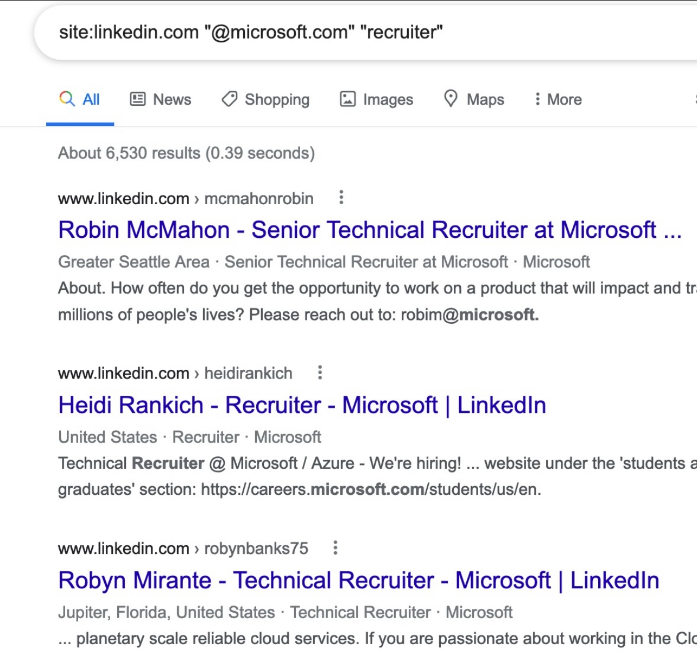

# About Project
Project utilizes Google search functionality to scan Linkedin for anything that has an email

## Example


```
let myLocalValue = `site:linkedin.com \"@${company}.com\" \"${searchTerm}\" email`;
```
is translated to
```
site:linkedin.com "@xxx.com" "recruiter" "email"
```

# How to run the project
1. Make sure nodejs is installed
2. Clone the project
3. Open up terminal
4. Run
```
npm install
```
5. Modify the input.csv for any companies you want, do not modify the first line where it says company
6. Run:
```
npm start
```
7. Follow instructions and wait for output to be spit out
> Note: if you want to change the specific search term being used:
> var searchTerm = 'recruiter';
